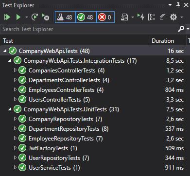
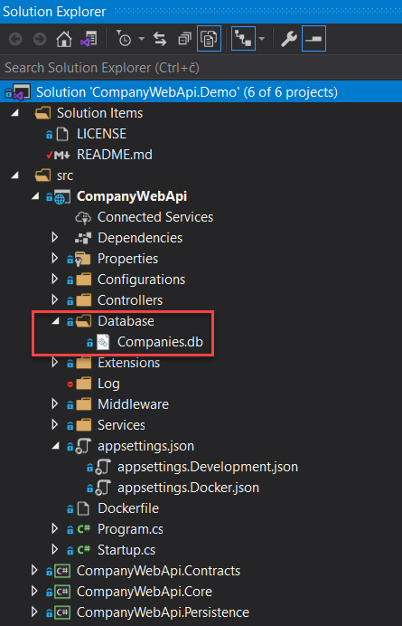
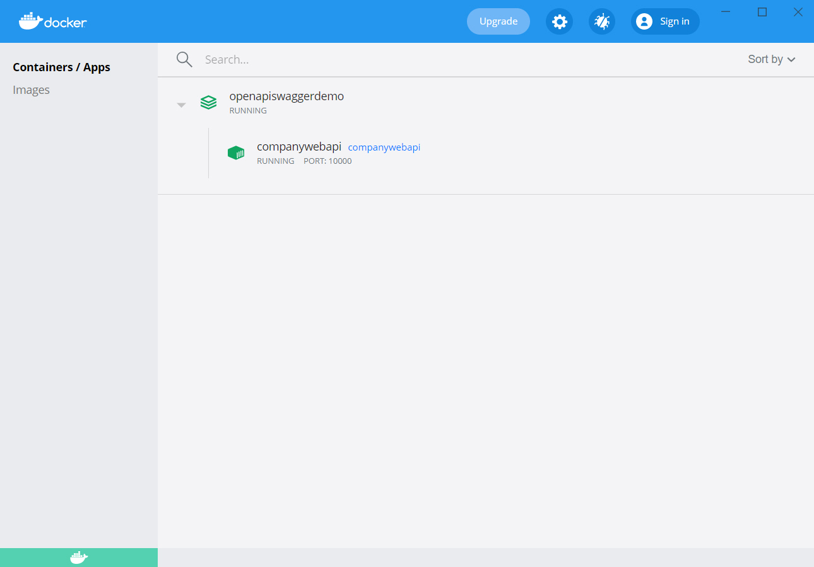
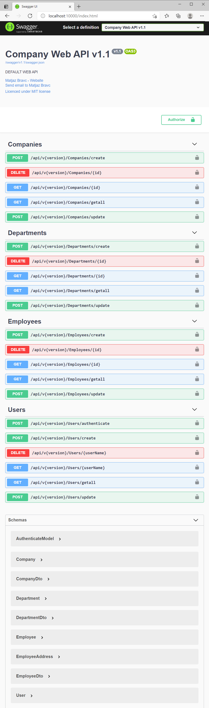

# OpenAPI.Swagger.Demo

In this comprehensive sample application I would like to show you **how to create JWT secured CRUD OpenAPI** using latest **ASP.NET Core 5.0**, documented with **Swagger** and tested with **Unit** and **Integration tests for secured API**. You will find also how to use **Entity Framework Core** with **SQLite database provider**, how to use **Serilog** for logging requests/responses, how to **generally capture exceptions** with custom middleware, etc. So, let’s start step by step.

## OpenAPI
[OpenAPI](https://swagger.io/specification/) is a widely used industry standard specification for documenting APIs and the [Swagger](https://swagger.io/) is a set of tools that implement this specification. For .NET, there is the [Swashbuckle.AspNetCore NuGet](https://www.nuget.org/packages/Swashbuckle.AspNetCore/) package that automatically produces a JSON document and an HTML, Javascript and CSS based documentation of your REST API based on the implementation of your controller classes and the data they return. Latest version of Swashbuckle supports ASP.NET Core 5.0 and [OpenAPI 3.1](https://www.openapis.org/blog/2021/02/18/openapi-specification-3-1-released), which is the latest version of the specification at the time of creating this demo.

## Setup OpenAPI/Swagger
Once you have installed the [Swashbuckle.AspNetCore NuGet](https://www.nuget.org/packages/Swashbuckle.AspNetCore/) package, you add the Swagger generator to the services collection in the **ConfigureServices** method in **Startup** class (see the "Configure Swagger support" line):

```csharp
public void ConfigureServices(IServiceCollection services)
{
    ...
    
    // Configure Swagger support (uses ServiceCollection extensions)
    services.ConfigureSwagger(API_NAME);
    
    ...
}
```
And ServiceCollection extensions looks like this:
```csharp
public static class ServiceExtensions
{
    ...
    
    public static void ConfigureSwagger(this IServiceCollection serviceCollection, string apiName, bool includeXmlDocumentation = true)
    {
        serviceCollection.AddSwaggerGen(options =>
        {
            options.SwaggerDoc("v1.0", new OpenApiInfo
            {
                Title = $"{apiName} v1.0",
                Version = "v1.0",
                Description = "*** DEPRECATED WEB API VERSION ***",
                Contact = new OpenApiContact
                {
                    Name = "Matjaz Bravc",
                    Email = "matjaz.bravc@gmail.com",
                    Url = new Uri("https://matjazbravc.github.io/")
                },
                License = new OpenApiLicense
                {
                    Name = "Use under LICENSE...",
                    Url = new Uri("https://example.com/license")
                }
            });
            options.SwaggerDoc("v1.1", new OpenApiInfo
            {
                Title = $"{apiName} v1.1",
                Version = "v1.1",
                Description = "DEFAULT WEB API",
                Contact = new OpenApiContact
                {
                    Name = "Matjaz Bravc",
                    Email = "matjaz.bravc@gmail.com",
                    Url = new Uri("https://matjazbravc.github.io/")
                },
                License = new OpenApiLicense
                {
                    Name = "Use under LICENSE...",
                    Url = new Uri("https://example.com/license")
                }
            });
            options.AddSecurityDefinition("Bearer", new OpenApiSecurityScheme
            {
                Description = "JWT Authorization header using the Bearer scheme. Example: \"Authorization: Bearer {token}\"",
                Name = "Authorization",
                Scheme = "Bearer",
                BearerFormat = "JWT",
                In = ParameterLocation.Header,
                Type = SecuritySchemeType.ApiKey
            });
            options.AddSecurityRequirement(new OpenApiSecurityRequirement
            {
                {
                      new OpenApiSecurityScheme
                        {
                            Reference = new OpenApiReference
                            {
                                Type = ReferenceType.SecurityScheme,
                                Id = "Bearer"
                            }
                        },
                        new string[] {}

                }
            });
            options.DocInclusionPredicate((docName, apiDesc) =>
            {
                var actionApiVersionModel = apiDesc.ActionDescriptor.GetApiVersionModel();
                // Would mean this action is unversioned and should be included everywhere
                if (actionApiVersionModel == null)
                {
                    return true;
                }
                return actionApiVersionModel.DeclaredApiVersions.Any() ? actionApiVersionModel.DeclaredApiVersions.Any(v => $"v{v.ToString()}" == docName) : actionApiVersionModel.ImplementedApiVersions.Any(v => $"v{v.ToString()}" == docName);
            });
            if (includeXmlDocumentation)
            {
                var xmlDocFile = Path.Combine(PlatformServices.Default.Application.ApplicationBasePath, $"{Assembly.GetExecutingAssembly().GetName().Name}.xml");
                if (File.Exists(xmlDocFile))
                {
                    options.IncludeXmlComments(xmlDocFile);
                }
            }
            options.DescribeAllParametersInCamelCase();
            options.ResolveConflictingActions(apiDescriptions => apiDescriptions.First());
        });
    }

    ...
}
```
In the **Configure** method, you then enable the middleware that serves the generated JSON document and the web UI that’s generated based on it:
```csharp
public void Configure(IApplicationBuilder app, IWebHostEnvironment env)
{
    ...
    
    // Enable middleware to serve generated Swagger as a JSON endpoint.
    app.UseSwagger();

    // Enable middleware to serve swagger-ui (HTML, JS, CSS, etc.), specifying the Swagger JSON endpoint
    // https://docs.microsoft.com/en-us/aspnet/core/tutorials/getting-started-with-swashbuckle?view=aspnetcore-3.1&tabs=visual-studio
    app.UseSwaggerUI(c =>
    {
        c.SwaggerEndpoint("/swagger/v1.1/swagger.json", $"{API_NAME} v1.1");
        c.SwaggerEndpoint("/swagger/v1.0/swagger.json", $"{API_NAME} v1.0");
        c.RoutePrefix = string.Empty;
    });
    
    ...
}
```
Then you can run your app and navigate to **http://localhost:52330/swagger/v1.1/swagger.json** to download the generated JSON document that describes your API. The web UI is at "http://localhost:52330/index.html" by default. You can set the **RoutePrefix** property of the **SwaggerUIOptions** object that gets passed to the UseSwaggerUI method to change the URL.

## Setup Serilog
For logging we are using as usual [Serilog](https://serilog.net/). For this we have to install [Serilog.AspNetCore NuGet](https://www.nuget.org/packages/Serilog.AspNetCore/) package and modify **Program.cs** file like this:
```csharp
public class Program
{
    public static void Main(string[] args)
    {
        CreateHostBuilder(args).Build().Run();
    }

    public static IHostBuilder CreateHostBuilder(string[] args) =>
        Host.CreateDefaultBuilder(args)
        // Configure Serilog
        .UseSerilog((hostingContext, loggerConfiguration) => loggerConfiguration
            .ReadFrom.Configuration(hostingContext.Configuration)
            .Enrich.FromLogContext())
        // Set the content root to be the current directory
        .UseContentRoot(Directory.GetCurrentDirectory())
        // Disable the dependency injection scope validation feature
        .UseDefaultServiceProvider(options => options.ValidateScopes = false)
        .ConfigureWebHostDefaults(webBuilder =>
        {
            webBuilder.UseStartup<Startup>();
        })
        .ConfigureAppConfiguration((builderContext, config) =>
        {
            var env = builderContext.HostingEnvironment;
            config.SetBasePath(env.ContentRootPath);
            config.AddJsonFile("appsettings.json", optional: false, reloadOnChange: true);
            config.AddJsonFile($"appsettings.{env.EnvironmentName}.json", optional: true, reloadOnChange: true);
            config.AddEnvironmentVariables();
        })
        .ConfigureLogging((builderContext, logging) =>
        {
            // Clear default logging providers
            logging.ClearProviders();
            logging.AddConsole();
            logging.AddSerilog();
        });
}
```
**Serilog** is configured with "**Serilog**" configuration section in **appsettings.json** file:
```json
{
  "ConnectionStrings": {
    "SqLiteConnectionString": "Data Source=./Database/Companies.db;Mode=ReadWriteCreate;Cache=Shared"
  },
  "JwtIssuerOptions": {
    "Issuer": "CompanyWebApi",
    "Audience": "http://localhost:5002/"
  },
  "AuthSettings": {
    "SecretKey": "THIS IS USED TO SIGN AND VERIFY JWT TOKENS, REPLACE IT WITH YOUR OWN SECRET, IT CAN BE ANY STRING"
  },
  "Serilog": {
    "Using": [ "Serilog.Sinks.File" ],
    "MinimumLevel": {
      "Default": "Information",
      "Override": {
        "Microsoft": "Warning",
        "System": "Warning"
      }
    },
    "Filter": [
      {
        "Name": "ByExcluding",
        "Args": {
          "expression": "StartsWith(SourceContext, 'Microsoft')"
        }
      }
    ],
    "WriteTo": [
      {
        "Name": "Console",
        "Args": {
          "outputTemplate": "{Timestamp:yyyy-MM-dd HH:mm:ss.fff} [{Level:u3}] [{SourceContext}] {Message}{NewLine}{Exception}",
          "restrictedToMinimumLevel": "Verbose"
        }
      },
      {
        "Name": "File",
        "Args": {
          "path": "./Log/AppLog.txt",
          "outputTemplate": "{Timestamp:yyyy-MM-dd HH:mm:ss.fff} [{Level:u3}] [{MemberName}] {Message}{NewLine}{Exception}",
          "fileSizeLimitBytes": 1073741824, // 1Gb
          "rollingInterval": "Day",
          "rollOnFileSizeLimit": true,
          "restrictedToMinimumLevel": "Information",
          "retainedFileCountLimit": "3",
          "shared": true,
          "flushToDiskInterval": "00:00:01"
        }
      }
    ],
    "Enrich": [ "FromLogContext" ]
  },
  "AllowedHosts": "*"   
}
```
## Configure SQLite database provider
For using **SQLite** database provider we have to install [Microsoft.EntityFrameworkCore.Sqlite NuGet](https://www.nuget.org/packages/Microsoft.EntityFrameworkCore.Sqlite) package and add database context to the services collection in the **ConfigureServices** method in Startup class:
```csharp
public void ConfigureServices(IServiceCollection services)
{
    ...
    
    // Add Database Context
    services.AddDbContext<ApplicationDbContext>(options =>
        options.UseSqlite(Configuration.GetConnectionString("SqLiteConnectionString")));
    
    ...
}
```
In the **Configure** method we Create a database and **Seed** test data:
```csharp
public void Configure(IApplicationBuilder app, IWebHostEnvironment env)
{
    ...
    
    // Configure Database context
    using (var serviceScope = app.ApplicationServices.GetService<IServiceScopeFactory>().CreateScope())
    {
        var context = serviceScope.ServiceProvider.GetRequiredService<ApplicationDbContext>();
        //context.Database.EnsureDeleted();
        context.Database.EnsureCreated();
        SeedData.Initialize(context);
    }
    
    ...
}
```
## Setup API Versioning
Now, in this step we will implement API versioning in Asp.Net Core 5.0 application.
First-of-all, for using API Versioning we have to install [Microsoft.AspNetCore.Mvc.Versioning NuGet](https://www.nuget.org/packages/Microsoft.AspNetCore.Mvc.Versioning/) package. Then we have to add Service in the **ConfigureServices** method in **Startup** class:
```csharp
public void ConfigureServices(IServiceCollection services)
{
    ...
    
    // Add API Versioning
    // The default version is 1.1
    // And we're going to read the version number from the media type
    // Incoming requests should have a accept header like this: Accept: application/json;v=1.1
    services.AddApiVersioning(o =>
    {
        o.DefaultApiVersion = new ApiVersion(1, 1); // Specify the default api version
        o.AssumeDefaultVersionWhenUnspecified = true; // Assume that the caller wants the default version if they don't specify
        o.ApiVersionReader = new MediaTypeApiVersionReader(); // Read the version number from the accept header
        o.ReportApiVersions = true; // Return Api version in response header
    });
    
    ...
}
```
We will use simple **URL path versioning scheme**. Using a version number directly in the URL path is one of the simplest way of versioning an API. URL path versioning approach is more visible since it explicitly states the version number in the URL itself. To implement URL path versioning, modify the **[Route]** attribute of the controllers to accept API versioning info in the path param like this:
```csharp
using System.Collections.Generic;
using System.Linq;
using System.Threading.Tasks;
using CompanyWebApi.Contracts.Converters;
using CompanyWebApi.Contracts.Dto;
using CompanyWebApi.Contracts.Entities;
using CompanyWebApi.Controllers.Base;
using CompanyWebApi.Core.Errors;
using CompanyWebApi.Services.Repositories;
using Microsoft.AspNetCore.Authorization;
using Microsoft.AspNetCore.Cors;
using Microsoft.AspNetCore.Mvc;
using Microsoft.Extensions.Logging;

namespace CompanyWebApi.Controllers
{
    [Authorize]
    [ApiController]
    [ApiVersion("1.0", Deprecated = true)]
    [ApiVersion("1.1")]
    [Produces("application/json")]
    [EnableCors("EnableCORS")]
    [Route("api/v{version:apiVersion}/[controller]")]
    public class CompaniesController : BaseController<CompaniesController>
    {
        private readonly ICompanyRepository _companyRepository;
        private readonly IConverter<Company, CompanyDto> _companyToDtoConverter;
        private readonly IConverter<IList<Company>, IList<CompanyDto>> _companyToDtoListConverter;

        public CompaniesController(ICompanyRepository companyRepository,
            IConverter<Company, CompanyDto> companyToDtoConverter,
            IConverter<IList<Company>, IList<CompanyDto>> companyToDtoListConverter)
        {
            _companyRepository = companyRepository;
            _companyToDtoConverter = companyToDtoConverter;
            _companyToDtoListConverter = companyToDtoListConverter;
        }
        ...
    }
}
```
## Setup Authentication & Authorization
**Authentication** is the process of determining a **user's identity**, **authorization** is the process of determining whether a **user has access to a resource**. In ASP.NET Core, authentication is handled by the **IAuthenticationService**, which is used by authentication middleware. The authentication service uses registered authentication handlers to complete authentication-related actions. For using JWT Authentication we have to install [Microsoft.AspNetCore.Authentication.JwtBearer NuGet](https://www.nuget.org/packages/Microsoft.AspNetCore.Authentication.JwtBearer) package. 

## Users Controller
The Users controller defines and handles all routes for the api that relate to users, this includes authentication and standard CRUD operations. Within each route the controller calls the user service to perform the action required, this enables the controller to stay completely separated from the business logic and data access code.
The controller actions are secured with JWT using the **[Authorize]** attribute, with the exception of the **Authenticate method** which allows public access by overriding the **[Authorize]** attribute on the controller with **[AllowAnonymous]** attribute on the action method. I chose this approach so any new action methods added to the controller will be secure by default unless explicitly made public.
```csharp
using CompanyWebApi.Contracts.Dto;
using CompanyWebApi.Contracts.Entities;
using CompanyWebApi.Controllers.Base;
using CompanyWebApi.Core.Errors;
using CompanyWebApi.Services.Authorization;
using CompanyWebApi.Services.Repositories;
using Microsoft.AspNetCore.Authorization;
using Microsoft.AspNetCore.Cors;
using Microsoft.AspNetCore.Mvc;
using Microsoft.Extensions.Logging;
using System.Collections.Generic;
using System.Linq;
using System.Threading.Tasks;

namespace CompanyWebApi.Controllers
{
    [Authorize]
    [ApiController]
    [ApiVersion("1.1")]
    [EnableCors("EnableCORS")]
    [Route("api/v{version:apiVersion}/[controller]")]
    public class UsersController : BaseController<UsersController>
    {
        private readonly IUserRepository _userRepository;
        private readonly IUserService _userService;
        public UsersController(IUserService userService, IUserRepository userRepository)
        {
            _userService = userService;
            _userRepository = userRepository;
        }

        /// <summary>
        /// Authenticate User
        /// </summary>
        /// <remarks>Public route that accepts HTTP POST requests containing the username and password in the body.
        /// If the username and password are correct then a JWT authentication token and the user details are returned.
        /// </remarks>
        /// POST /api/users/v1.1/authenticate/{user}
        /// <param name="model"></param>
        /// <returns>User with token</returns>
		[AllowAnonymous]
        [HttpPost("authenticate")]
        public async Task<IActionResult> AuthenticateAsync([FromBody] AuthenticateModel model)
        {
            var user = await _userService.AuthenticateAsync(model.Username, model.Password).ConfigureAwait(false);
            if (user == null)
            {
                return BadRequest(new { message = "Username or password is incorrect" });
            }
            return Ok(user);
        }

        /// <summary>
        /// Create User
        /// </summary>
        /// <remarks>This API will create new User</remarks>
        /// POST /api/users/v1.1/create/{user}
        /// <param name="user">User model</param>
        /// <param name="apiVersion">API Version</param>
        [MapToApiVersion("1.1")]
        [HttpPost("create", Name = "CreateUser")]
        [ProducesResponseType(201, Type = typeof(User))]
        [ProducesResponseType(204)]
        [ProducesResponseType(400)]
        public async Task<IActionResult> CreateAsync([FromBody] User user, ApiVersion apiVersion)
        {
            Logger.LogDebug("CreateAsync");
            if (user == null)
            {
                return BadRequest(new BadRequestError("The user is null"));
            }
            await _userRepository.AddAsync(user).ConfigureAwait(false);
            return CreatedAtRoute("GetUserByUserName", new { userName = user.Username, version = apiVersion.ToString() }, user);
        }

        /// <summary>
        /// Delete User
        /// </summary>
        /// <remarks>This API will delete User with userName</remarks>
        /// GET /api/users/v1.1/{userName}
        /// <param name="userName"></param>
        /// <returns>Return User</returns>
        [MapToApiVersion("1.1")]
        [HttpDelete("{userName}", Name = "DeleteUserByName")]
        [ProducesResponseType(204)]
        [ProducesResponseType(404)]
        public async Task<ActionResult> DeleteAsync(string userName)
        {
            Logger.LogDebug("DeleteAsync");
            var user = await _userRepository.GetSingleAsync(user => user.Username == userName).ConfigureAwait(false);
            if (user == null)
            {
                return NotFound(new NotFoundError("The User was not found"));
            }
            await _userRepository.DeleteAsync(user).ConfigureAwait(false);
            return NoContent();
        }

        /// <summary>
        /// Get all Users
        /// </summary>
        /// <remarks>Secure route that accepts HTTP GET requests and returns a list of all the users in the application 
        /// if the HTTP Authorization header contains a valid JWT token.
        /// If there is no auth token or the token is invalid then a 401 Unauthorized response is returned.
        /// </remarks>
        /// GET /api/users/v1.1/getall
        /// <returns>List of Users</returns>
        [MapToApiVersion("1.1")]
        [HttpGet("getall")]
        public async Task<ActionResult<IList<User>>> GetAllAsync()
        {
            Logger.LogDebug("GetAllAsync");
            var users = await _userRepository.GetAllAsync().ConfigureAwait(false);
            if (!users.Any())
            {
                return NotFound(new NotFoundError("The Users list is empty"));
            }
            var result = users.Select(user => new
            {
                user.Username,
                user.Password,
                EmployeeFirstName = user.Employee?.FirstName,
                EmployeeLastName = user.Employee?.LastName
            }).ToList();
            return Ok(result);
        }

        /// <summary>
        /// Get User
        /// </summary>
        /// <remarks>This API return User with Username</remarks>
        /// GET /api/users/v1.1/{userName}
        /// <param name="userName"></param>
        /// <returns>Return User</returns>
        [MapToApiVersion("1.1")]
        [HttpGet("{userName}", Name = "GetUserByUserName")]
        [ProducesResponseType(200, Type = typeof(User))]
        [ProducesResponseType(404)]
        public async Task<ActionResult<User>> GetAsync(string userName)
        {
            Logger.LogDebug("GetAsync");
            var user = await _userRepository.GetSingleAsync(user => user.Username.Equals(userName)).ConfigureAwait(false);
            if (user == null)
            {
                return NotFound(new NotFoundError("The User was not found"));
            }
            return Ok(user);
        }

        /// <summary>
        /// Update User
        /// </summary>
        /// POST /api/users/v1.1/update/{user}
        /// <param name="user"></param>
        /// <param name="apiVersion">API Version</param>
        /// <returns>Returns updated User</returns>
        [MapToApiVersion("1.1")]
        [HttpPost("update", Name = "UpdateUser")]
        [ProducesResponseType(201, Type = typeof(User))]
        [ProducesResponseType(400)]
        public async Task<IActionResult> UpdateAsync([FromBody] User user, ApiVersion apiVersion)
        {
            Logger.LogDebug("UpdateAsync");
            if (user == null)
            {
                return BadRequest(new BadRequestError("The retrieved user is null"));
            }
            var updatedUser = await _userRepository.UpdateAsync(user);
            if (updatedUser == null)
            {
                return BadRequest(new BadRequestError("The updated user is null"));
            }
            return CreatedAtRoute("GetUserByUserName", new { userName = user.Username, version = apiVersion.ToString() }, user);
        }
    }
}
```
## User Entity
The **User** entity class represents the data for a user in the application. Entity classes are used to pass data between different parts of the application (e.g. between services and controllers) and can be used to return http response data from controller action methods. If multiple types of entities or other custom data is required to be returned from a controller method then a custom model class should be created in the Entities folder for the response.
```csharp
using CompanyWebApi.Contracts.Entities.Base;
using Newtonsoft.Json;
using System.ComponentModel.DataAnnotations.Schema;
using System.ComponentModel.DataAnnotations;
using System.Diagnostics.CodeAnalysis;
using System;

namespace CompanyWebApi.Contracts.Entities
{
    [Serializable]
    [ExcludeFromCodeCoverage]
    [JsonObject(IsReference = false)]
    public class User : BaseAuditEntity
    {
        [Key, ForeignKey(nameof(Employee))]
        public int EmployeeId { get; set; }
        
        // Navigation property
        public Employee Employee { get; set; }
        
        [Required]
        public string Username { get; set; }
        
        [Required]
        public string Password { get; set; }
        
        public string Token { get; set; }
        
        public override string ToString() => $"{EmployeeId}, {Username}";
    }
}
```
## User Service
The User service contains a method for authenticating user credentials and returning a JWT token, and all methods for CRUD oprations. **In a production application it is recommended to store user records in a database with hashed passwords.**
On successful authentication the Authenticate method generates a JWT (JSON Web Token) using the JwtSecurityTokenHandler class which generates a token that is digitally signed using a secret key stored in **appsettings.json**. The JWT token is returned to the client application which must include it in the HTTP **Authorization header** of subsequent requests to secure routes.
```csharp
using CompanyWebApi.Configurations;
using CompanyWebApi.Contracts.Entities;
using CompanyWebApi.Core.Auth;
using CompanyWebApi.Services.Repositories;
using Microsoft.Extensions.Options;
using System.Threading.Tasks;

namespace CompanyWebApi.Services.Authorization
{
	public class UserService : IUserService
	{
        private readonly AuthSettings _authSettings;
        private readonly IUserRepository _userRepository;
        private readonly IJwtFactory _jwtFactory;

        public UserService(IOptions<AuthSettings> authSettings, IUserRepository userRepository, IJwtFactory jwtFactory)
        {
            _userRepository = userRepository;
            _jwtFactory = jwtFactory;
            _authSettings = authSettings.Value;
        }
        
        public async Task<User> AuthenticateAsync(string username, string password)
        {
            var user = await _userRepository.GetSingleAsync(x => x.Username == username && x.Password == password).ConfigureAwait(false);
            if (user == null)
            {
            	return null;
            }
            user.Token = string.IsNullOrEmpty(_authSettings.SecretKey) ? null : _jwtFactory.EncodeToken(user.Username);
            // Remove password before returning!
            user.Password = null;
            return user;
        }
    }
}
```
## JWT Settings
**IMPORTANT**: The "**SecretKey**" property in configuration file **appsettings.json** is used by the API to sign and verify JWT tokens for authentication, update it with your own random string to ensure nobody else can generate a JWT to gain unauthorised access to your application!
```json
  ...    
  
  "JwtIssuerOptions": {
    "Issuer": "CompanyWebApi",
    "Audience": "http://localhost:5002/"
  },
  "AuthSettings": {
    "SecretKey": "THIS IS USED TO SIGN AND VERIFY JWT TOKENS, REPLACE IT WITH YOUR OWN SECRET, IT CAN BE ANY STRING"
  },
  
  ...
```
# Integration testing
With an integration test, we test the API from the outside out by spinning up the API client and making an actual HTTP request. We will consume my API in the same way as an application (or user) would.

## Preparing a New Project for Integration Testing
We are going to create a new xUnit project named **CompanyWebApi.Tests** for integration/unit testing. Additionally, we will install a [AspNetCore.Mvc.Testing NuGet](https://www.nuget.org/packages/Microsoft.AspNetCore.Mvc.Testing) package required for the testing. This package provides the **TestServer** and **WebApplicationFactory** class to help us bootstrap our app in-memory.
Also we have to install [Microsoft.EntityFrameworkCore.InMemory NuGet](https://www.nuget.org/packages/Microsoft.EntityFrameworkCore.InMemory) package which is an In-memory database provider.
**WebApiTestFactory** class implements the **WebApplicationFactory<Startup>** class and overrides the **ConfigureWebHost** method. In that method, we **remove the ApplicationDbContext** registration from the **Startup.cs** class. Then, we are adding Entity Framework in-memory database support to the DI container via the ServiceCollection class.
## Wait! How to test a secured API?
How we can fake any authentication we need, without the need to really authenticate a user? Simple. :)
With usage of [WebMotions.Fake.Authentication.JwtBearer](https://github.com/DOMZE/fake-authentication-jwtbearer#fake-authentication-jwt-bearer-for-aspnet-core-31) NuGet package. In the **WebApiTestFactory** class and in the  **ConfigureWebHost** method we have to add authentication which adds fake Jwt Bearer token:
```csharp
using CompanyWebApi.Persistence.DbContexts;
using CompanyWebApi.Services;
using Microsoft.AspNetCore.Hosting;
using Microsoft.AspNetCore.Mvc.Testing;
using Microsoft.AspNetCore.TestHost;
using Microsoft.EntityFrameworkCore;
using Microsoft.Extensions.DependencyInjection;
using Microsoft.Extensions.Hosting;
using Microsoft.Extensions.Logging;
using System.Linq;
using System;
using WebMotions.Fake.Authentication.JwtBearer;

namespace CompanyWebApi.Tests.Services
{
    /// <summary>
    /// Customized WebApplicationFactory
    /// </summary>
    public class WebApiTestFactory : WebApplicationFactory<Startup>
    {
        protected override void ConfigureWebHost(IWebHostBuilder builder)
        {
            builder
                .UseContentRoot(".") // Content root directory for web host
                .UseTestServer() // Add TestServer
                .UseEnvironment("Test") // Specify the environment
                .ConfigureTestServices(services =>
                {
                    // Remove the app's ApplicationDbContext registration
                    var descriptor = services.SingleOrDefault(d => d.ServiceType == typeof(DbContextOptions<ApplicationDbContext>));
                    if (descriptor != null)
                    {
                        services.Remove(descriptor);
                    }

                    // Add EntityFramework InMemoryDatabase
                    var serviceProvider = new ServiceCollection()
                      .AddEntityFrameworkInMemoryDatabase()
                      .BuildServiceProvider();

                    // Add ApplicationDbContext using an in-memory database for testing
                    services.AddDbContext<ApplicationDbContext>(options =>
                    {
                        options.UseInMemoryDatabase("InMemoryDatabaseTest");
                        options.UseInternalServiceProvider(serviceProvider);
                    });

                    // Build the service provider
                    var sp = services.BuildServiceProvider();

                    // Create a scope to obtain a reference to the database context (ApplicationDbContext)
                    using (var scope = sp.CreateScope())
                    {
                        var scopedServices = scope.ServiceProvider;
                        var dbContext = scopedServices.GetRequiredService<ApplicationDbContext>();
                        var logger = scopedServices.GetRequiredService<ILogger<WebApiTestFactory>>();

                        // Ensure the database is created
                        dbContext.Database.EnsureCreated();

                        try
                        {
                            // Seed the database with test data
                            SeedData.Initialize(dbContext);
                        }
                        catch (Exception ex)
                        {
                            logger.LogError(ex, $"An error occurred seeding the database with test messages. Error: {ex.Message}");
                        }
                    }

                    // Add fake Jwt Bearer authentication
                    services.AddAuthentication(options =>
                    {
                        options.DefaultAuthenticateScheme = FakeJwtBearerDefaults.AuthenticationScheme;
                        options.DefaultChallengeScheme = FakeJwtBearerDefaults.AuthenticationScheme;
                    }).AddFakeJwtBearer();
                });

            // Call base Configuration
            base.ConfigureWebHost(builder);
        }
    }
}
```
That's it! Run all tests, and finally results are as expected :)



# Run the solution from Docker

## Compose containers

**Docker-compose.yml** file with setup for all the containers looks like this:
```yml
version: '3.6'

services:
  companywebapi:
    container_name: companywebapi
    image: ${DOCKER_REGISTRY-}companywebapi
    restart: on-failure
    hostname: companywebapi
    build:
      context: .
      dockerfile: src/CompanyWebApi/Dockerfile
    volumes:
      - "./sqlite-database-volume:/Database"
```
and **Docker-compose.override.yml** file:
```yml
version: '3.6'

services:
  companywebapi:
    environment:
        - ASPNETCORE_ENVIRONMENT=Docker
        - ASPNETCORE_URLS=http://+:80
    ports:
        - 10000:80
```
To execute compose file, open Powershell, and navigate to the compose file in the root folder. Then execute the following command: **docker-compose up -d --build**. The -d parameter executes the command detached. This means that the containers run in the background and don’t block your Powershell window. To check all running Containers use **docker ps**.

To be able to host a SQLite database file in Docker we have to create Volume
**"sqlite-database-volume"** which points to the **"Database"** folder from solution.



It is worth to mention that environment variable  **ASPNETCORE_ENVIRONMENT=*Docker*** points to **appsettings.*Docker*.json** file where SQLite connection string points to database file:
```json
{
  "ConnectionStrings": {
    "SqLiteConnectionString": "Data Source=file:Companies.db;Mode=ReadWriteCreate;Cache=Shared"
  },
  "Serilog": {
    "MinimumLevel": {
      "Default": "Information",
      "Override": {
        "Microsoft": "Information",
        "System": "Warning"
      }
    }
  }
}
```



Navigating to **[http://localhost:10000/index.html](http://localhost:10000/index.html)** opens Swagger UI and you can play with endpoints.



## Prerequisites
- [Visual Studio](https://www.visualstudio.com/vs/community) 2019 16.8.4 or greater
- [.NET SDK 5.0](https://dotnet.microsoft.com/download/dotnet/5.0)
- [Docker](https://www.docker.com/resources/what-container)

## Tags & Technologies
- [.NET 5.0](https://github.com/dotnet/core/blob/main/release-notes/5.0/5.0.5/5.0.5.md)
- [Docker](https://www.docker.com/resources/what-container)  
- [ASP.NET Core 5.0](https://docs.microsoft.com/en-us/aspnet/core/release-notes/aspnetcore-5.0?view=aspnetcore-5.0)
- [Entity Framework Core 5.0](https://docs.microsoft.com/en-us/ef/core/)

Enjoy!

## Licence
Licenced under [MIT](http://opensource.org/licenses/mit-license.php).
Contact me on [LinkedIn](https://si.linkedin.com/in/matjazbravc).
