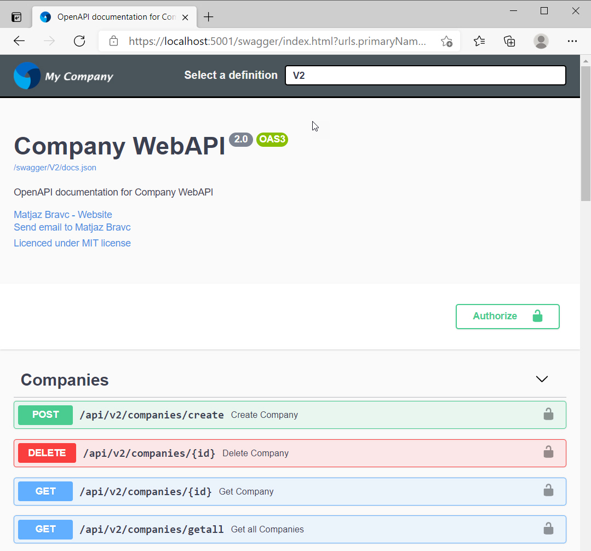

# OpenAPI.Swagger.Demo

This comprehensive sample application shows **how to create JWT secured, versioned CRUD OpenAPI** using latest **.NET 6**, documented with **Swagger** and tested with **Unit** and **Integration tests for secured API**. You can find also how to use **Entity Framework Core** with **SQLite database provider**, how to use **Serilog** for logging requests/responses, how to **generally capture exceptions** with custom middleware, etc.

## OpenAPI
[OpenAPI](https://swagger.io/specification/) is a widely used industry standard specification for documenting APIs and the [Swagger](https://swagger.io/) is a set of tools that implement this specification. For .NET, there is the [Swashbuckle.AspNetCore NuGet](https://www.nuget.org/packages/Swashbuckle.AspNetCore/) package that automatically produces a JSON document and an HTML, Javascript and CSS based documentation of your REST API based on the implementation of your controller classes and the data they return. Latest version of Swashbuckle supports .NET 6 and [OpenAPI 3.1](https://www.openapis.org/blog/2021/02/18/openapi-specification-3-1-released), which is the latest version of the specification at the time of creating this demo.

## Setup OpenAPI/Swagger
Once you have installed the [Swashbuckle.AspNetCore NuGet](https://www.nuget.org/packages/Swashbuckle.AspNetCore/) package, you add the Swagger generator to the services collection in the **ConfigureServices** method in **Startup** class (see the "Adds Swagger support" line):

```csharp
public void ConfigureServices(IServiceCollection services)
{
    ...
    
    // Adds Swagger support
    services.AddSwaggerMiddleware();

    ...
}
```
Middleware is defined in ServiceCollection:
```csharp
public static class ServiceExtensions
{
    ...
    
    /// <summary>
    /// Adds Swagger support
    /// </summary>
    /// <param name="services"></param>
    /// <returns></returns>
    public static void AddSwaggerMiddleware(this IServiceCollection services)
    {
        // Configure Swagger Options
        services.AddTransient<IConfigureOptions<SwaggerUIOptions>, ConfigureSwaggerUiOptions>();
        services.AddTransient<IConfigureOptions<SwaggerGenOptions>, ConfigureSwaggerGenOptions>();

        // Register the Swagger generator
        services.AddSwaggerGen();
    }

    ...
}
```
This approach uses two helpers, first is **ConfigureSwaggerUiOptions** which configure **SwaggerUIOptions**:
```csharp
/// <summary>
/// Configures the Swagger UI options
/// </summary>
public class ConfigureSwaggerUiOptions : IConfigureOptions<SwaggerUIOptions>
{
    private readonly SwaggerConfig _swaggerConfig;
    private readonly IApiVersionDescriptionProvider _apiProvider;

    /// <summary>
    /// Initialises a new instance of the <see cref="ConfigureSwaggerUiOptions"/> class.
    /// </summary>
    /// <param name="apiProvider">The API provider.</param>
    /// <param name="swaggerConfig"></param>
    public ConfigureSwaggerUiOptions(IApiVersionDescriptionProvider apiProvider, IOptions<SwaggerConfig> swaggerConfig)
    {
        _apiProvider = apiProvider ?? throw new ArgumentNullException(nameof(apiProvider));
        _swaggerConfig = swaggerConfig.Value;
    }

    /// <inheritdoc />
    public void Configure(SwaggerUIOptions options)
    {
        options = options ?? throw new ArgumentNullException(nameof(options));
        options.RoutePrefix = _swaggerConfig.RoutePrefix;
        options.DocumentTitle = _swaggerConfig.Description;
        options.DocExpansion(DocExpansion.List);
        options.DefaultModelExpandDepth(0);

        // Configure Swagger JSON endpoints
        foreach (var description in _apiProvider.ApiVersionDescriptions)
        {
            options.SwaggerEndpoint($"/{_swaggerConfig.RoutePrefix}/{description.GroupName}/docs.json", description.GroupName);
        }
    }
}
```
A second one is **ConfigureSwaggerGenOptions** which configure **SwaggerGenOptions**:
```csharp
/// <summary>
/// Configures the Swagger generation options
/// </summary>
/// <remarks>This allows API versioning to define a Swagger document per API version after the
/// <see cref="IApiVersionDescriptionProvider"/> service has been resolved from the service container.</remarks>
public class ConfigureSwaggerGenOptions : IConfigureOptions<SwaggerGenOptions>
{
    private readonly string _appName;
    private readonly IApiVersionDescriptionProvider _apiProvider;
    private readonly SwaggerConfig _swaggerConfig;

    /// <summary>
    /// Initializes a new instance of the <see cref="ConfigureSwaggerGenOptions"/> class
    /// </summary>
    /// <param name="apiProvider">The <see cref="IApiVersionDescriptionProvider">apiProvider</see> used to generate Swagger documents.</param>
    /// <param name="swaggerConfig"></param>
    public ConfigureSwaggerGenOptions(IApiVersionDescriptionProvider apiProvider, IOptions<SwaggerConfig> swaggerConfig)
    {
        _apiProvider = apiProvider ?? throw new ArgumentNullException(nameof(apiProvider));
        _swaggerConfig = swaggerConfig.Value;
        _appName = Assembly.GetExecutingAssembly().GetName().Name ?? string.Empty;
    }

    /// <inheritdoc />
    public void Configure(SwaggerGenOptions options)
    {
        // Add a custom operation filter which sets default values
        options.OperationFilter<SwaggerDefaultValues>();

        // Add a swagger document for each discovered API version
        // Note: you might choose to skip or document deprecated API versions differently
        foreach (var description in _apiProvider.ApiVersionDescriptions)
        {
            options.SwaggerDoc(description.GroupName, CreateInfoForApiVersion(description));
        }

        // Add JWT Bearer Authorization
        options.AddSecurityDefinition("Bearer", new OpenApiSecurityScheme
        {
            Description = "JWT Authorization header using the Bearer scheme. Example: \"Authorization: Bearer {token}\"",
            Name = "Authorization",
            In = ParameterLocation.Header,
            Type = SecuritySchemeType.ApiKey
        });

        // Add Security Requirement
        options.AddSecurityRequirement(new OpenApiSecurityRequirement
        {
            {
                new OpenApiSecurityScheme
                {
                    Reference = new OpenApiReference
                    {
                        Type = ReferenceType.SecurityScheme,
                        Id = "Bearer"
                    },
                    Scheme = "oauth2",
                    Name = "Bearer",
                    In = ParameterLocation.Header,
                },
                new List<string>()
            }
        });

        // Include Document file
        var xmlFile = $"{Assembly.GetExecutingAssembly().GetName().Name}.xml";
        var xmlPath = Path.Combine(AppContext.BaseDirectory, xmlFile);
        options.IncludeXmlComments(xmlPath);
    }

    /// <summary>
    /// Create API version
    /// </summary>
    /// <param name="description"></param>
    /// <returns></returns>
    private OpenApiInfo CreateInfoForApiVersion(ApiVersionDescription description)
    {
        var info = new OpenApiInfo()
        {
            Title = _swaggerConfig.Title,
            Version = description.ApiVersion.ToString(),
            Description = _swaggerConfig.Description,
            Contact = new OpenApiContact
            {
                Name = _swaggerConfig.ContactName,
                Email = _swaggerConfig.ContactEmail,
                Url = new Uri(_swaggerConfig.ContactUrl)
            },
            License = new OpenApiLicense
            {
                Name = _swaggerConfig.LicenseName,
                Url = new Uri(_swaggerConfig.LicenseUrl)
            },
            // Add a logo to ReDoc page
            Extensions = new Dictionary<string, IOpenApiExtension>
            {
                {
                    "x-logo", new OpenApiObject
                    {
                        {"url", new OpenApiString("/wwwroot/swagger/company-logo-redoc.png")}
                    }
                }
            }
        };

        if (description.IsDeprecated)
        {
            info.Description += " ** THIS API VERSION HAS BEEN DEPRECATED!";
        }

        return info;
    }
}
```

In the **Configure** method, have to enable the **Swagger** middleware:
```csharp
public void Configure(IApplicationBuilder app, IWebHostEnvironment env)
{
    ...
    
    // Register Swagger and SwaggerUI middleware
    app.UseSwaggerMiddleware(config);
    
    ...
}
```
**UseSwaggerMiddleware** is defined in the AppExtensions:
```csharp
public static class AppExtensions
{
    /// <summary>
    /// Adds global exception handling middleware
    /// </summary>
    /// <param name="app"></param>
    public static IApplicationBuilder UseApiExceptionHandling(this IApplicationBuilder app)
        => app.UseMiddleware<ApiExceptionHandlingMiddleware>();

    /// <summary>
    /// Register Swagger and SwaggerUI middleware
    /// </summary>
    /// <param name="app"></param>
    /// <param name="config"></param>
    public static void UseSwaggerMiddleware(this IApplicationBuilder app, IConfiguration config)
    {
        var swaggerConfig = config.GetSection(nameof(SwaggerConfig)).Get<SwaggerConfig>();
        app.UseSwagger(options =>
        {
            options.RouteTemplate = $"{swaggerConfig.RoutePrefix}/{{documentName}}/{swaggerConfig.DocsFile}";
        });
        app.UseSwaggerUI(options =>
        {
            options.InjectStylesheet($"/{swaggerConfig.RoutePrefix}/swagger-custom-ui-styles.css");
            options.InjectJavascript($"/{swaggerConfig.RoutePrefix}/swagger-custom-script.js");
        });
    }

    /// <summary>
    /// Register the ReDoc middleware
    /// </summary>
    /// <param name="app"></param>
    /// <param name="config"></param>
    public static void UseReDocMiddleware(this IApplicationBuilder app, IConfiguration config)
    {
        var swaggerConfig = config.GetSection(nameof(SwaggerConfig)).Get<SwaggerConfig>();
        app.UseReDoc(sa =>
        {
            sa.DocumentTitle = $"{swaggerConfig.Title} Documentation";
            sa.SpecUrl = $"/{swaggerConfig.RoutePrefix}/V2/{swaggerConfig.DocsFile}";
        });
    }
}
```
In the **launchSettings.json** we've defined several profiles, default one is **Development**:
```json
{
  "iisSettings": {
    "windowsAuthentication": false,
    "anonymousAuthentication": true,
    "iisExpress": {
      "applicationUrl": "http://localhost:52330",
      "sslPort": 0
    }
  },
  "$schema": "http://json.schemastore.org/launchsettings.json",
  "profiles": {
    "Development": {
      "commandName": "Project",
      "launchBrowser": true,
      "launchUrl": "api-docs/index.html?urls.primaryName=v2",
      "environmentVariables": {
        "ASPNETCORE_ENVIRONMENT": "Development"
      },
      "dotnetRunMessages": "true",
      "applicationUrl": "https://localhost:5001;http://localhost:5000"
    },
    "Docker": {
      "commandName": "Docker",
      "launchBrowser": true,
      "launchUrl": "{Scheme}://{ServiceHost}:{ServicePort}/swagger",
      "publishAllPorts": true
    }
  }
}
```
As you can notice **launchUrl** points to the custom route and sets **v2** as default API version.

## Run solution
You can run solution with **Development** profile or navigate to **https://localhost:5001/api-docs/index.html?urls.primaryName=v2**.

## Setup Serilog
For logging we are using as usual [Serilog](https://serilog.net/). For this we have to install [Serilog.AspNetCore NuGet](https://www.nuget.org/packages/Serilog.AspNetCore/) package and modify **Program.cs** file like this:
```csharp
public static class Program
{
    public static void Main(string[] args)
    {
        CreateHostBuilder(args).Build().Run();
    }

    public static IHostBuilder CreateHostBuilder(string[] args) =>
        Host.CreateDefaultBuilder(args)
            // Configure Serilog
            .UseSerilog((context, services, configuration) => configuration
                .ReadFrom.Configuration(context.Configuration)
                .ReadFrom.Services(services)
                //.MinimumLevel.Override("Microsoft", LogEventLevel.Information)
                //.MinimumLevel.Override("Microsoft.AspNetCore", LogEventLevel.Warning)
                .Enrich.FromLogContext())
            // Set the content root to be the current directory
            .UseContentRoot(Directory.GetCurrentDirectory())
            // Disable the dependency injection scope validation feature
            .UseDefaultServiceProvider(options => options.ValidateScopes = false)
            .ConfigureWebHostDefaults(webBuilder =>
            {
                webBuilder.UseStartup<Startup>()
                    .UseKestrel();
            })
            .ConfigureAppConfiguration((builderContext, config) =>
            {
                var env = builderContext.HostingEnvironment;
                config.SetBasePath(env.ContentRootPath);
                config.AddJsonFile("appsettings.json", optional: false, reloadOnChange: true);
                config.AddJsonFile($"appsettings.{env.EnvironmentName}.json", optional: true, reloadOnChange: true);
                config.AddEnvironmentVariables();
            })
            .ConfigureLogging(logging =>
            {
                // Clear default logging providers
                logging.ClearProviders();
                logging.AddConsole();
                logging.AddSerilog();
            });
}
```
**Serilog** is configured with "**Serilog**" configuration section in **appsettings.json** file:
```json
{
  "ConnectionStrings": {
    "SqLiteConnectionString": "Data Source=./Database/Companies.db;Mode=ReadWriteCreate;Cache=Shared"
  },
  "JwtIssuerOptions": {
    "Issuer": "CompanyWebApi",
    "Audience": "http://localhost:5002/"
  },
  "AuthSettings": {
    "SecretKey": "THIS IS USED TO SIGN AND VERIFY JWT TOKENS, REPLACE IT WITH YOUR OWN SECRET, IT CAN BE ANY STRING"
  },
  "SwaggerConfig": {
    "Title": "Company WebAPI",
    "Description": "OpenAPI documentation for Company WebAPI",
    "ContactName": "Matjaz Bravc",
    "ContactEmail": "matjaz.bravc@gmail.com",
    "ContactUrl": "https://matjazbravc.github.io/",
    "LicenseName": "Licenced under MIT license",
    "LicenseUrl": "http://opensource.org/licenses/mit-license.php",
    "RoutePrefix": "api-docs",
    "RouteTemplate": "api-docs/{documentName}/docs.json"
  },
  "Serilog": {
    "Using": [ "Serilog.Sinks.File" ],
    "MinimumLevel": {
      "Default": "Information",
      "Override": {
        "Microsoft": "Warning",
        "System": "Warning"
      }
    },
    "Filter": [
      {
        "Name": "ByExcluding",
        "Args": {
          "expression": "StartsWith(SourceContext, 'Microsoft')"
        }
      }
    ],
    "WriteTo": [
      {
        "Name": "Console",
        "Args": {
          "outputTemplate": "{Timestamp:yyyy-MM-dd HH:mm:ss.fff} [{Level:u3}] [{SourceContext}] {Message}{NewLine}{Exception}",
          "restrictedToMinimumLevel": "Verbose"
        }
      },
      {
        "Name": "File",
        "Args": {
          "path": "./Log/AppLog.txt",
          "outputTemplate": "{Timestamp:yyyy-MM-dd HH:mm:ss.fff} [{Level:u3}] {Message}{NewLine}{Exception}",
          "fileSizeLimitBytes": 1073741824, // 1Gb
          "rollingInterval": "Day",
          "rollOnFileSizeLimit": true,
          "restrictedToMinimumLevel": "Information",
          "retainedFileCountLimit": "3",
          "shared": true,
          "flushToDiskInterval": "00:00:01"
        }
      }
    ],
    "Enrich": [ "FromLogContext" ]
  },
  "AllowedHosts": "*"
}
```
## Configure SQLite database provider
For using **SQLite** database provider we have to install [Microsoft.EntityFrameworkCore.Sqlite NuGet](https://www.nuget.org/packages/Microsoft.EntityFrameworkCore.Sqlite) package and add database context to the services collection in the **ConfigureServices** method in Startup class:
```csharp
public void ConfigureServices(IServiceCollection services)
{
    ...
    
    // Add Database Context
    services.AddDbContext<ApplicationDbContext>(options =>
        options.UseSqlite(Configuration.GetConnectionString("SqLiteConnectionString")));
    
    ...
}
```
In the **Configure** method we Create a database and **Seed** test data:
```csharp
public void Configure(IApplicationBuilder app, IWebHostEnvironment env)
{
    ...
    
    // Configure Database context
    using (var serviceScope = app.ApplicationServices.GetService<IServiceScopeFactory>().CreateScope())
    {
        var context = serviceScope.ServiceProvider.GetRequiredService<ApplicationDbContext>();
        context.Database.EnsureCreated();
        SeedData.Initialize(context);
    }
    
    ...
}
```
## Setup API Versioning
Now, in this step we will implement API versioning in Asp.Net Core 5.0 application. First-of-all, for using API Versioning we have to install [Microsoft.AspNetCore.Mvc.Versioning.ApiExplorer NuGet](https://www.nuget.org/packages/Microsoft.AspNetCore.Mvc.Versioning.ApiExplorer/5.0.0) package. Then we have to add Service in the **ConfigureServices** method in **Startup** class:
```csharp
public void ConfigureServices(IServiceCollection services)
{
    ...
    // Adds service API versioning
    services.AddAndConfigureApiVersioning();
    ...
}
```
The **AddAndConfigureApiVersioning** middleware is define in  ServiceCollection:
```csharp
public static class ServiceExtensions
{
    ...
    
    /// <summary>
    /// Adds service API versioning
    /// </summary>
    /// <param name="services"></param>
    public static void AddAndConfigureApiVersioning(this IServiceCollection services)
    {
        services.Configure<RouteOptions>(options =>
        {
            options.LowercaseUrls = true;
        });

        services.AddApiVersioning(config =>
        {
            // Default API Version
            config.DefaultApiVersion = new ApiVersion(2, 0);
            // use default version when version is not specified
            config.AssumeDefaultVersionWhenUnspecified = true;
            // Advertise the API versions supported for the particular endpoint
            config.ReportApiVersions = true;
        });

        services.AddVersionedApiExplorer(options =>
        {
            // add the versioned api explorer, which also adds IApiVersionDescriptionProvider service
            // note: the specified format code will format the version as "'v'major[.minor][-status]"
            options.GroupNameFormat = "'v'VVV";

            // note: this option is only necessary when versioning by url segment. the SubstitutionFormat
            // can also be used to control the format of the API version in route templates
            options.SubstituteApiVersionInUrl = true;
        });
    }
        
    ...
}
```
We use simple **URL path versioning scheme**. Using a version number directly in the URL path is one of the simplest way of versioning an API. URL path versioning approach is more visible since it explicitly states the version number in the URL itself. To implement URL path versioning, modify the **[Route]** attribute of the controllers to accept API versioning info in the path param like this:
```csharp
namespace CompanyWebApi.Controllers.V2
{
    [Authorize]
    [ApiController]
    [ApiVersion("2.0")]
    [Produces("application/json")]
    [EnableCors("EnableCORS")]
    [Route("api/v{version:apiVersion}/[controller]")]
    public class CompaniesController : BaseController<CompaniesController>
    {
        private readonly ICompanyRepository _companyRepository;
        private readonly IConverter<Company, CompanyDto> _companyToDtoConverter;
        private readonly IConverter<IList<Company>, IList<CompanyDto>> _companyToDtoListConverter;

        public CompaniesController(ICompanyRepository companyRepository,
            IConverter<Company, CompanyDto> companyToDtoConverter,
            IConverter<IList<Company>, IList<CompanyDto>> companyToDtoListConverter)
        {
            _companyRepository = companyRepository;
            _companyToDtoConverter = companyToDtoConverter;
            _companyToDtoListConverter = companyToDtoListConverter;
        }
        ...
    }
}
```
To let Swagger understand the different API versions we have to add a "group by name" convention **VersionByNamespaceConvention** to **AddAndConfigureApiVersioning** middleware:
```csharp
public static class ServiceExtensions
{
...

    /// <summary>
    /// Adds service API versioning
    /// </summary>
    /// <param name="services"></param>
    public static void AddAndConfigureApiVersioning(this IServiceCollection services)
    {
        services.AddApiVersioning(options =>
        {
            // Specify the default API Version
            options.DefaultApiVersion = new ApiVersion(2, 0);
            // Use default version when version is not specified
            options.AssumeDefaultVersionWhenUnspecified = true;
            // Advertise the API versions supported for the particular endpoint
            options.ReportApiVersions = true;
            // Adds a convention to let Swagger understand the different API versions
            options.Conventions.Add(new VersionByNamespaceConvention());
        });

        services.AddVersionedApiExplorer(options =>
        {
            // Add the versioned api explorer, which also adds IApiVersionDescriptionProvider service
            // Note: the specified format code will format the version as "'V'major[.minor][-status]"
            options.GroupNameFormat = "'V'VVV";

            // Note: this option is only necessary when versioning by url segment.
            // The SubstitutionFormat can also be used to control the format of the API version in route templates.
            options.SubstituteApiVersionInUrl = true;
        });
    }
    
...
}
```
## Setup Authentication & Authorization
**Authentication** is the process of determining a **user's identity**, **authorization** is the process of determining whether a **user has access to a resource**. In ASP.NET Core, authentication is handled by the **IAuthenticationService**, which is used by authentication middleware. The authentication service uses registered authentication handlers to complete authentication-related actions. For using JWT Authentication we have to install [Microsoft.AspNetCore.Authentication.JwtBearer NuGet](https://www.nuget.org/packages/Microsoft.AspNetCore.Authentication.JwtBearer) package. 

## UsersController
The **UsersController** defines and handles all routes for the api that relate to users, this includes authentication and standard CRUD operations. Within each route the controller calls the user service to perform the action required, this enables the controller to stay completely separated from the business logic and data access code.
The controller actions are secured with JWT using the **[Authorize]** attribute, with the exception of the **Authenticate method** which allows public access by overriding the **[Authorize]** attribute on the controller with **[AllowAnonymous]** attribute on the action method. I chose this approach so any new action methods added to the controller will be secure by default unless explicitly made public.

## UserService
The **UserService** contains a method for authenticating user credentials and returning a JWT token, and all methods for CRUD oprations. **In a production application it is recommended to store user records in a database with hashed passwords.**
On successful authentication the Authenticate method generates a JWT (JSON Web Token) using the JwtSecurityTokenHandler class which generates a token that is digitally signed using a secret key stored in **appsettings.json**. The JWT token is returned to the client application which must include it in the HTTP **Authorization header** of subsequent requests to secure routes.

## JWT Settings
**IMPORTANT**: The "**SecretKey**" property in configuration file **appsettings.json** is used by the API to sign and verify JWT tokens for authentication, update it with your own random string to ensure nobody else can generate a JWT to gain unauthorised access to your application!
```json
  ...    
  
  "JwtIssuerOptions": {
    "Issuer": "CompanyWebApi",
    "Audience": "http://localhost:5002/"
  },
  "AuthSettings": {
    "SecretKey": "THIS IS USED TO SIGN AND VERIFY JWT TOKENS, REPLACE IT WITH YOUR OWN SECRET, IT CAN BE ANY STRING"
  },
  
  ...
```
# Integration testing
With an integration test, we test the API from the outside out by spinning up the API client and making an actual HTTP request. We will consume my API in the same way as an application (or user) would.

## Preparing a New Project for Integration Testing
We are going to create a new xUnit project named **CompanyWebApi.Tests** for integration/unit testing. Additionally, we will install a [AspNetCore.Mvc.Testing NuGet](https://www.nuget.org/packages/Microsoft.AspNetCore.Mvc.Testing) package required for the testing. This package provides the **TestServer** and **WebApplicationFactory** class to help us bootstrap our app in-memory.
Also we have to install [Microsoft.EntityFrameworkCore.InMemory NuGet](https://www.nuget.org/packages/Microsoft.EntityFrameworkCore.InMemory) package which is an In-memory database provider.
**WebApiTestFactory** class implements the **WebApplicationFactory<Startup>** class and overrides the **ConfigureWebHost** method. In that method, we **remove the ApplicationDbContext** registration from the **Startup.cs** class. Then, we are adding Entity Framework in-memory database support to the DI container via the ServiceCollection class.
## Wait! How to test a secured API?
How we can fake any authentication we need, without the need to really authenticate a user? Simple. :)
With usage of [WebMotions.Fake.Authentication.JwtBearer](https://github.com/DOMZE/fake-authentication-jwtbearer#fake-authentication-jwt-bearer-for-aspnet-core-31) NuGet package. In the **WebApiTestFactory** class and in the  **ConfigureWebHost** method we have to add authentication which adds fake Jwt Bearer token:
```csharp
using CompanyWebApi.Persistence.DbContexts;
using CompanyWebApi.Services;
using Microsoft.AspNetCore.Hosting;
using Microsoft.AspNetCore.Mvc.Testing;
using Microsoft.AspNetCore.TestHost;
using Microsoft.EntityFrameworkCore;
using Microsoft.Extensions.DependencyInjection;
using Microsoft.Extensions.Hosting;
using Microsoft.Extensions.Logging;
using System.Linq;
using System;
using WebMotions.Fake.Authentication.JwtBearer;

namespace CompanyWebApi.Tests.Services
{
    /// <summary>
    /// Customized WebApplicationFactory
    /// </summary>
    public class WebApiTestFactory : WebApplicationFactory<Startup>
    {
        protected override void ConfigureWebHost(IWebHostBuilder builder)
        {
            builder
                .UseContentRoot(".") // Content root directory for web host
                .UseTestServer() // Add TestServer
                .UseEnvironment("Test") // Specify the environment
                .ConfigureTestServices(services =>
                {
                    // Remove the app's ApplicationDbContext registration
                    var descriptor = services.SingleOrDefault(d => d.ServiceType == typeof(DbContextOptions<ApplicationDbContext>));
                    if (descriptor != null)
                    {
                        services.Remove(descriptor);
                    }

                    // Add EntityFramework InMemoryDatabase
                    var serviceProvider = new ServiceCollection()
                      .AddEntityFrameworkInMemoryDatabase()
                      .BuildServiceProvider();

                    // Add ApplicationDbContext using an in-memory database for testing
                    services.AddDbContext<ApplicationDbContext>(options =>
                    {
                        options.UseInMemoryDatabase("InMemoryDatabaseTest");
                        options.UseInternalServiceProvider(serviceProvider);
                    });

                    // Build the service provider
                    var sp = services.BuildServiceProvider();

                    // Create a scope to obtain a reference to the database context (ApplicationDbContext)
                    using (var scope = sp.CreateScope())
                    {
                        var scopedServices = scope.ServiceProvider;
                        var dbContext = scopedServices.GetRequiredService<ApplicationDbContext>();
                        var logger = scopedServices.GetRequiredService<ILogger<WebApiTestFactory>>();

                        // Ensure the database is created
                        dbContext.Database.EnsureCreated();

                        try
                        {
                            // Seed the database with test data
                            SeedData.Initialize(dbContext);
                        }
                        catch (Exception ex)
                        {
                            logger.LogError(ex, $"An error occurred seeding the database with test messages. Error: {ex.Message}");
                        }
                    }

                    // Add fake Jwt Bearer authentication
                    services.AddAuthentication(options =>
                    {
                        options.DefaultAuthenticateScheme = FakeJwtBearerDefaults.AuthenticationScheme;
                        options.DefaultChallengeScheme = FakeJwtBearerDefaults.AuthenticationScheme;
                    }).AddFakeJwtBearer();
                });

            // Call base Configuration
            base.ConfigureWebHost(builder);
        }
    }
}
```
That's it! Run all tests, and finally results are as expected :)


# Run the solution from Docker

## Compose containers

**Docker-compose.yml** file with setup for all the containers looks like this:
```yml
version: '3.9'

services:
  companywebapi:
    container_name: companywebapi
    image: ${DOCKER_REGISTRY-}companywebapi
    restart: on-failure
    hostname: companywebapi
    build:
      context: .
      dockerfile: src/CompanyWebApi/Dockerfile
    volumes:
      - "./sqlite-database-volume:/Database"
```
and **Docker-compose.override.yml** file:
```yml
version: '3.9'

services:
  companywebapi:
    environment:
        - ASPNETCORE_ENVIRONMENT=Docker
        - ASPNETCORE_URLS=http://+:80
    ports:
        - 10000:80
```
To execute compose file, open Powershell, and navigate to the compose file in the root folder. Then execute the following command: **docker-compose up -d --build --remove-orphans**. The -d parameter executes the command detached. This means that the containers run in the background and don’t block your Powershell window. To check all running Containers use **docker ps**.

To be able to host a SQLite database file in Docker we have to create Volume
**"sqlite-database-volume"** which points to the **"Database"** folder from solution.


It is worth to mention that environment variable  **ASPNETCORE_ENVIRONMENT=*Docker*** points to **appsettings.*Docker*.json** file where SQLite connection string points to database file:
```json
{
  "ConnectionStrings": {
    "SqLiteConnectionString": "Data Source=file:Companies.db;Mode=ReadWriteCreate;Cache=Shared"
  },
  "Serilog": {
    "MinimumLevel": {
      "Default": "Information",
      "Override": {
        "Microsoft": "Information",
        "System": "Warning"
      }
    }
  }
}
```


Navigating to **[http://localhost:10000/swagger/index.html?urls.primaryName=v2](http://localhost:10000/swagger/index.html?urls.primaryName=v2)** opens Swagger UI with API v2.



## API documentation with ReDoc
We will additionally document our API with [ReDoc](https://redoc.ly/). For this we have to include the **UseReDocMiddleware** in the Configure method:
```csharp
...

    // Register ReDoc middleware
    app.UseReDocMiddleware(config);
    
...
```
If you run the application by default the swagger interface will appear navigate to **[http://localhost:10000/api-docs](http://localhost:10000/api-docs)** to see the ReDoc interface as the figure below.


You can find ReDoc interactive demo [here](http://redocly.github.io/redoc/) and a blog post [here](https://swagger.io/blog/api-development/redoc-openapi-powered-documentation/).

To rapidly expose your applications API frameworks such as ReDoc and Swagger is definitely a quick and practical solution. Swagger and ReDoc both offer a free and paid version and should be explored to adjust the user’s needs.
  
I hope this demo will be a good start for your next OpenAPI project! Enjoy!

## Prerequisites
- [Visual Studio](https://www.visualstudio.com/vs/community) 2019 16.9.4 or greater
- [.NET SDK 5.0](https://dotnet.microsoft.com/download/dotnet/5.0)
- [Docker](https://www.docker.com/resources/what-container)

## Tags & Technologies
- [.NET 5.0](https://github.com/dotnet/core/blob/main/release-notes/5.0/5.0.5/5.0.5.md)
- [Docker](https://www.docker.com/resources/what-container)  
- [ASP.NET Core 5.0](https://docs.microsoft.com/en-us/aspnet/core/release-notes/aspnetcore-5.0?view=aspnetcore-5.0)
- [Entity Framework Core 5.0](https://docs.microsoft.com/en-us/ef/core/)
- [Swagger](https://swagger.io/)
- [ReDoc](https://redoc.ly/)

## Tools
[Favicon Generator for ASP.NET Core](https://realfavicongenerator.net/favicon/aspnet_core)

## Licence
Licenced under [MIT](http://opensource.org/licenses/mit-license.php).
Contact me on [LinkedIn](https://si.linkedin.com/in/matjazbravc).
